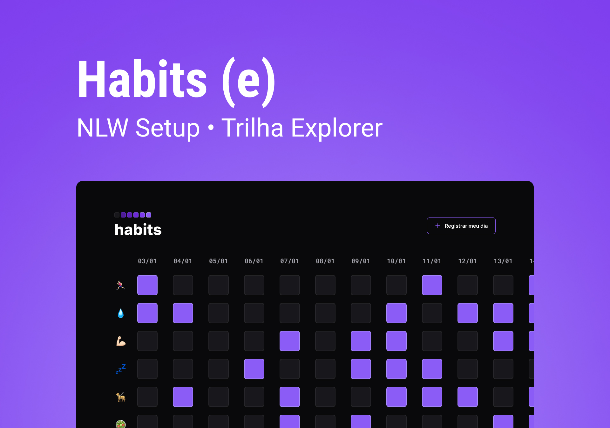

<h1 align="center"> Habits </h1>

<p>
O Habits é um Habit tracker, ou seja, é um sistema que auxilia o utilizador a ter um controle de hábitos através do acompanhamento constante. Esse projeto foi promovido pela Rocketseat para ensino de tecnologias WEB, durante o NLW, evento exclusivo e gratuito.<br/>
</p>

<p align="center">
  <a href="#-tecnologias">Tecnologias</a>&nbsp;&nbsp;&nbsp;|&nbsp;&nbsp;&nbsp;
  <a href="#-funcionalidades">Funcionalidades</a>&nbsp;&nbsp;&nbsp;|&nbsp;&nbsp;&nbsp;
  <a href="#-layout">Layout</a>&nbsp;&nbsp;&nbsp;|&nbsp;&nbsp;&nbsp;
  <a href="#memo-licença">Licença</a>
</p>

<p align="center">
  
</p>

<br>

<p align="center">
  
</p>

## 🚀 Tecnologias

Esse projeto foi desenvolvido com as seguintes tecnologias:

- HTML e CSS
- JavaScript
- Git e Github
- Figma

## 💻 Funcionalidades:

- [x] Adicionar, editar e remover hábitos
- [x] Acompanhe seus hábitos
- [x] Layout web e mobile

## 🔖 Layout

Você pode visualizar o layout do projeto através [DESSE LINK](https://www.figma.com/community/file/1195327109778210238). É necessário ter conta no [Figma](https://figma.com) para acessá-lo.

## 🚀 Instalação e uso

```bash
# Clone o repositório
git clone https://github.com/Alexandre-Schmidt/habits.git

# Acesse a pasta do projeto
cd habits

# Instale as dependências
npm install

# Execute a aplicação
npm run dev

# O servidor inciará na porta:3000 - acesse http://localhost:3000
```

## :memo: Licença

Esse projeto está sob a licença MIT.

---

:wave: Confira meu perfil profissional no [LinkedIn](https://www.linkedin.com/in/alexandreborgesschmidt/)
